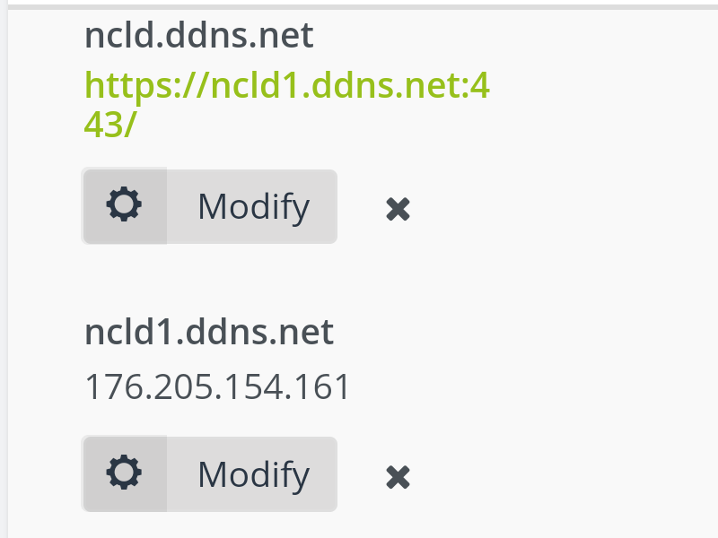
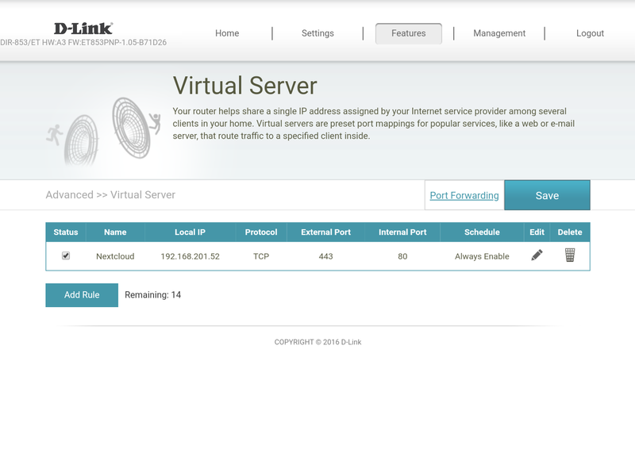

Пошто Етисалат блокира порт 80, certbot не може да обнови сертификат. Због тога је потребно да се ураде следећи кораци како би обнављање SSL сертификата за Nextcloud сервер било успешно.

Неопходно је да се промене **no-ip.org** DNS записи и подеси прослеђивање порта кроз рутер.

### Процедура

1. Подесити DNS записе као на слици:
	
	
	У **ncld.ddns.org** се постави *Web redirect* запис **https://ncld1.ddns.net:443/** a **ncld1.ddns.org** има А запис који показује на тренутну јавну адресу сервера.

2. Подесити прослеђивање порта као на слици:
	
	

3. Извршити команду на Nextcloud серверу:
	
	~~~
	root@nextcloud:~ # certbot-2.7 renew
	Saving debug log to /var/log/letsencrypt/letsencrypt.log
	
	- - - - - - - - - - - - - - - - - - - - - - - - - - - - - - - - - - - - - - - -
	Processing /usr/local/etc/letsencrypt/renewal/ncld.ddns.net.conf
	- - - - - - - - - - - - - - - - - - - - - - - - - - - - - - - - - - - - - - - -
	Cert is due for renewal, auto-renewing...
	Plugins selected: Authenticator webroot, Installer None
	Renewing an existing certificate
	Performing the following challenges:
	http-01 challenge for ncld.ddns.net
	Using the webroot path /usr/local/www/nextcloud for all unmatched domains.
	Waiting for verification...
	Cleaning up challenges
	
	- - - - - - - - - - - - - - - - - - - - - - - - - - - - - - - - - - - - - - - -
	new certificate deployed without reload, fullchain is
	/usr/local/etc/letsencrypt/live/ncld.ddns.net/fullchain.pem
	- - - - - - - - - - - - - - - - - - - - - - - - - - - - - - - - - - - - - - - -
	
	- - - - - - - - - - - - - - - - - - - - - - - - - - - - - - - - - - - - - - - -
	
	Congratulations, all renewals succeeded. The following certs have been renewed:
	  /usr/local/etc/letsencrypt/live/ncld.ddns.net/fullchain.pem (success)
	- - - - - - - - - - - - - - - - - - - - - - - - - - - - - - - - - - - - - - - -
	root@nextcloud:~ #
	~~~

4. Вратити све на стара подешавања

> Нови сертификат ће да се учита тек када се поново покрене веб сервер: `services apache24 restart`
